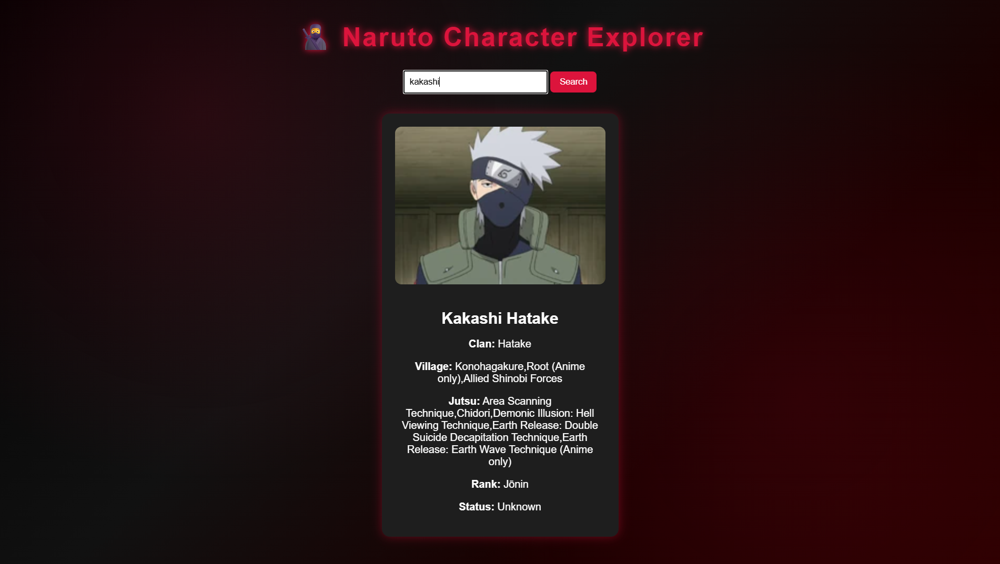
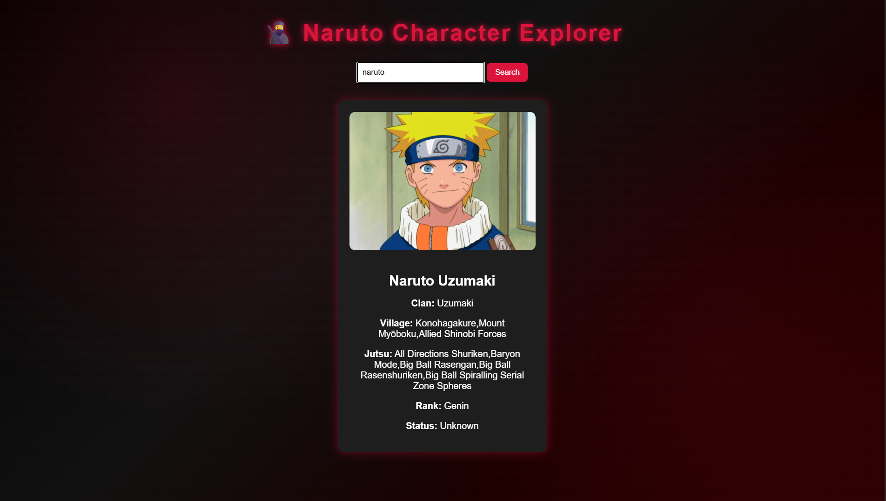
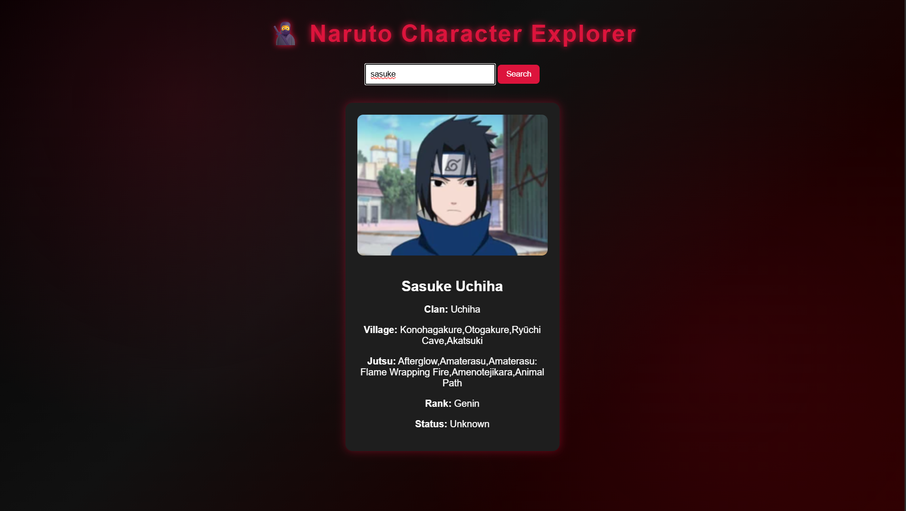
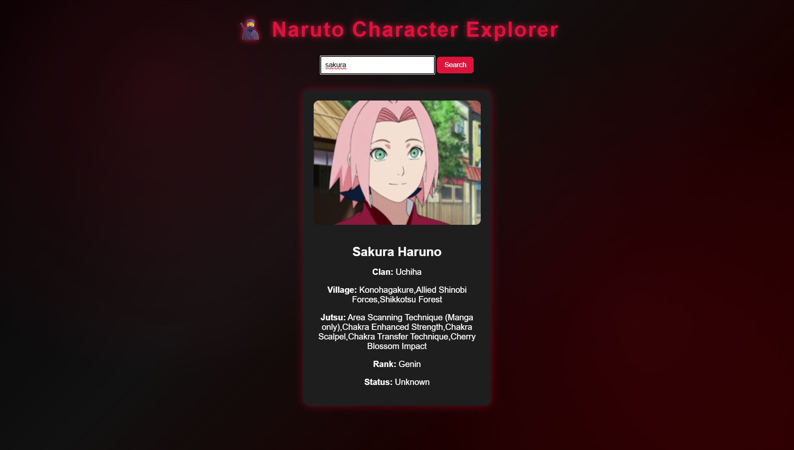

# 🥷 Naruto Character Explorer

An interactive character search web application inspired by the Naruto universe. This project allows users to search for a shinobi by name and instantly view detailed information such as clan, village affiliation, jutsu, ninja rank, and current status.

The goal of this project was to practice real-world API integration, modern JavaScript (ES6+), dynamic DOM manipulation, and themed UI design while building something inspired by one of my favorite anime worlds.

---

## 🚀 Features

* 🔎 Search characters by name
* 🖼 Display official character images
* 🏯 Show clan information
* 🌍 Show village affiliation
* 🔥 Display known jutsu (limited for clean UI)
* 🎖 Show ninja rank (Part I / Part II when available)
* 💀 Display character status (Alive / Dead / Unknown)
* ⚡ Fetch data using the Fetch API with async/await
* ❗ Graceful handling of missing or incomplete API data
* 🩸 Akatsuki-inspired red and black theme
* 🌫 Smooth fade-in animation for character cards

---

## 🖼 Preview

### 🔴 Kakashi Search

### 🔴 Naruto Search

### 🔴 Sasuke Search

### 🔴 Sakura Search

## 🛠 Tech Stack

* HTML5
* CSS3 (Animations & Theme Styling)
* JavaScript (ES6+)
* Dattebayo Naruto API

---

## 📂 Project Structure

naruto-character-explorer/
│
├── index.html
├── style.css
├── script.js
└── README.md

---

## 🧠 What I Practiced

* Working with external REST APIs
* Using async/await for asynchronous operations
* DOM manipulation and dynamic content rendering
* Handling nested JSON responses
* Defensive programming and error handling
* Creating animated UI effects with CSS

---

## 🔮 Future Enhancements

* Display multiple matching results
* Add advanced filters (Village, Clan, Rank)
* Implement modal popups for detailed character views
* Add pagination for large result sets
* Improve responsiveness for all screen sizes
* 🌥 Add animated Akatsuki clouds in the background
* 🔴 Add a red cursor glow effect for immersive interaction
* 🎵 Add a background music toggle (Akatsuki theme)

---

## 📌 Status

For now, this project is completed. It may receive updates in the very far future as I continue improving my frontend skills.

---

Made with passion for the shinobi world 🥷🩸🔥
